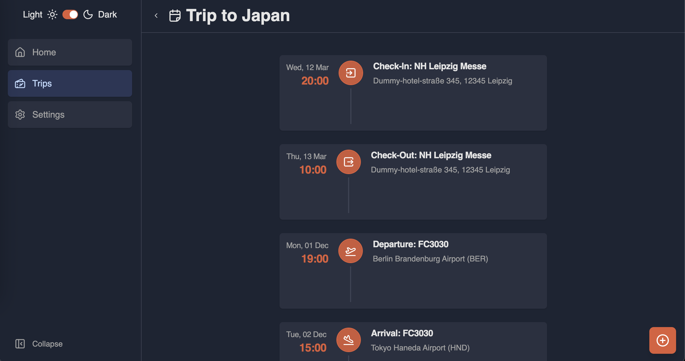
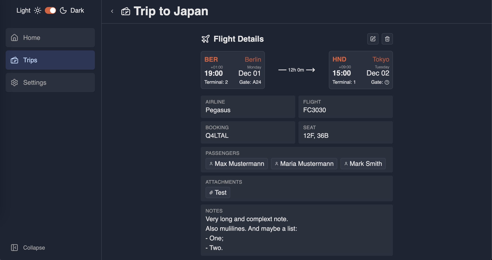
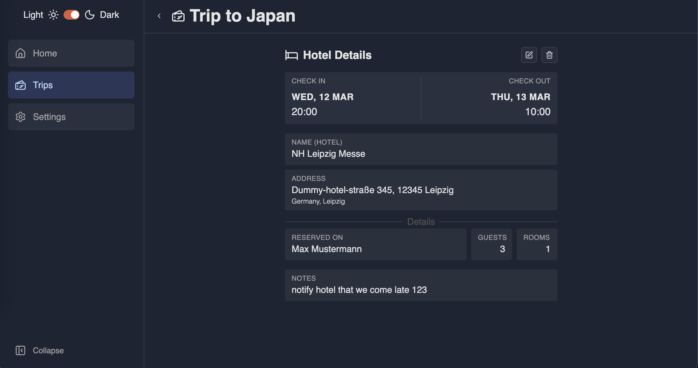

# Reisenotiz

A self-hosted, offline-first travel notes built as a PWA for keeping track of trips, flights, accommodations, and travel documents — all stored locally in your browser.

> **MVP Stage** — This project is in early development. Features are limited, data is stored in browser localStorage only (no backend sync yet), and breaking changes may occur. Use at your own risk and back up any important data.

## Screenshots

[Screen Recording](https://youtu.be/QkUDu_-Ed7w)





## Features

- **Trip Management** — Create and organize trips with timeline views
- **Flight Tracking** — Log flights with airport lookup (IATA codes, timezones)
- **Accommodations** — Track hotels and other lodging with check-in/out details
- **Custom Records** — Save your own airports and accommodation sites for quick reuse
- **Offline-First PWA** — Works without internet, installable on mobile and desktop
- **Dark Mode** — Light and dark theme support
- **Passenger Management** — Track travelers across trip items
- **Attachment Support** — Add notes and attachments to trip items

## Installation

### Docker Compose (example)

```yaml
services:
  app:
    image: ghcr.io/mrmodest/reisenotiz:edge-amd64 # change tag to `edge-arm64` for ARM64 builds
    ports:
      - "8080:8080"
    # Uncomment to run with custom UID/GID
    # user: "1000:1000"
    restart: unless-stopped
```

1. Open [http://localhost:8080](http://localhost:8080) in your browser.

### Build from source

Requires Node.js 24+ and pnpm.

```bash
pnpm install
pnpm build
pnpm preview
```

## Roadmap

See [ROADMAP.md](./ROADMAP.md) for planned features and future direction.

## AI Disclamer

- The project is defenetely **NOT** vibe-coded.
- I'm a Software Engineer, and I wrote the majority of the code manually myself.
- I do use AI, but do not trust it more than I would trust a random answer from Stack Overflow
- I won't accept AI's code until it fits my vision of code quality. I feed it with code examples written by myself manually.
- Even by the app UX/UI you can see that AI would generate something less shitty than I did :D

## License

### TLDR:
- BSL 1.1 (Source-available, fair code)
- Free forever for private/non-commercial use.
- Restricted for commercial use.

### Why not fully Open Source?

Because I simply want to protect myself from someone forking and monitizing my code. But Open-Source by its nature doesn't allow resticting commercial usage. This project will always be free for selfhosters and non-commercials. 

If I ever add some paid functionality, it would be something related to additional costs from my side. For example, if I provide a paid API for auto-suggestions that involves me paying to a third-party metadata providers or hosting the API service for you. But even in this case the app will be fully functional without it, or you can just make your own API provided for auto-suggestions.

I believe my license is fair enough since it's not some kind of library you need to inject into your own code. It's a final client application that ment to be used as is.

While the code can't be considered trully open-sources, I think it still fits under "Fair Code" terms.
See more here: https://fair.io/licenses/
